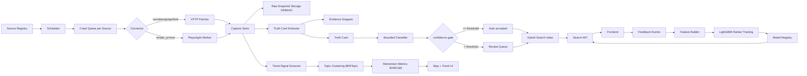

# NXT Link 24/7 Intelligence System

## 1) Pipeline Diagram



## 2) System Components

### Source Registry
- Tables: `sources`, `crawl_queue`, `source_reliability_history`.
- One queue lane per source (`source_id`) with independent retries/circuit state.
- Scheduling policy:
  - periodic enqueue by `crawl_frequency_minutes`
  - burst-safe dequeue using priority + domain limit
  - dead-letter when `attempt_count >= max_attempts`.

### Crawl Engine
- Connector abstraction per `crawl_method`: RSS, sitemap, API, HTML/search-page.
- Fetch strategy:
  - HTTP for static pages
  - Playwright only when `render_js = true`.
- Reliability controls:
  - exponential backoff with jitter
  - per-domain token bucket
  - circuit breaker per source
  - conditional requests (`ETag`, `If-Modified-Since`)
  - snapshot storage to object store (`raw`, `rendered`, `text`).

### Truth Card Extraction
- Input: `captures` row + snapshot payload.
- Output: `vendor_truth_cards` + `evidence_snippets`.
- Hard guarantees:
  - every claim references one or more evidence snippet IDs
  - no extracted field emitted if unsupported by evidence.

### Controlled Classification
- Bounded ontology:
  - industries
  - problem categories
  - solution types
  - capability tags.
- Classifier output contract:
  - selected labels
  - confidence
  - evidence references
  - unknown candidates.
- Routing:
  - `confidence >= threshold`: auto accepted
  - `confidence < threshold`: `review_queue`.

### Hybrid Search
- BM25: Postgres FTS (`card_text_tsv`) with `ts_rank_cd`.
- Semantic: pgvector cosine similarity (`card_embedding`).
- Blended score: weighted linear blend + reliability + freshness + evidence strength + feedback boost.

### Learning-to-Rank
- Training source: `search_results` + `user_feedback_events`.
- LightGBM ranker with query-grouped training.
- Nightly loop:
  1. build feature rows
  2. build relevance labels from feedback
  3. train ranker
  4. validate with `NDCG@10`
  5. register artifact + staged rollout
  6. promote only if gate passes.

### Trend Detection
- Inputs:
  - jobs
  - patents
  - exhibitor density
  - product launches
  - GitHub activity.
- Aggregation windows: 30/90/180 days.
- Outputs:
  - growth rate
  - saturation
  - geographic concentration
  - momentum score.
- Clustering:
  - BERTopic on normalized signal descriptions
  - fallback embedding clustering.

## 3) Crawler Module Structure

```
app/
  crawler/
    engine.py               # queue orchestration + retries + circuit breaker
    rate_limiter.py         # per-domain token bucket
    circuit_breaker.py      # source-level open/half-open/closed states
    connectors/
      base.py               # connector interface
      rss.py
      sitemap.py
      html.py
      api.py
      search_page.py
```

## 4) Extraction Module Design

```
app/extraction/
  preprocess.py             # html/pdf normalization
  evidence.py               # quote extraction with offsets
  truth_card.py             # structured card assembly
  quality_gate.py           # minimum evidence and claim quality
```

Truth card generation order:
1. normalize document text
2. detect candidate sections (features, integrations, deployment, geography)
3. extract factual bullets
4. bind bullets to quote-level evidence
5. drop unsupported fields
6. persist card + evidence.

## 5) Classification Flow

1. Load latest truth card text + evidence pointers.
2. Apply bounded ontology classifier.
3. Validate against schema.
4. Compute confidence from:
   - label agreement
   - evidence coverage
   - source reliability.
5. If low confidence:
   - store unknown candidate labels
   - enqueue review item.

## 6) Ranking Training Loop

1. Collect `search_results` joined with `user_feedback_events`.
2. Feature set:
   - BM25 score
   - vector score
   - ontology match score
   - evidence strength score
   - freshness
   - source reliability
   - interaction priors.
3. Label mapping:
   - reject=0
   - click=1
   - save=2
   - edit=3.
4. Train `LGBMRanker`.
5. Evaluate with NDCG@10 and failure thresholds.
6. Register model in `ml_model_registry`.
7. Shadow deploy, then promote if better than production baseline.

## 7) Trend Detection Pipeline

1. Ingest trend events into `trend_signals`.
2. Create rolling aggregates for 30/90/180 windows.
3. Compute:
   - growth = (current_window - previous_window) / max(previous_window,1)
   - saturation = normalized signal density
   - geographic concentration = Herfindahl-style region concentration.
4. Cluster categories with BERTopic labels.
5. Persist `trend_metrics`.
6. Serve map layer via API with time-window filters.

## 8) Monitoring and Logging Plan

### Metrics
- crawler:
  - success rate by source/category
  - median fetch latency
  - queue lag
  - dead-letter count.
- extraction/classification:
  - evidence coverage
  - confidence distribution
  - review queue growth.
- search/ranking:
  - CTR@k, Save@k, Reject@k
  - NDCG drift
  - model win-rate vs control.
- trends:
  - ingestion freshness by signal type
  - cluster stability score.

### Logs and Traces
- Structured JSON logs with `trace_id`.
- Every mutation writes to `audit_log`.
- Per-capture provenance retained via snapshot URI and evidence references.

### Alerting
- Alert on:
  - source failure streak
  - queue lag SLA breaches
  - confidence collapse
  - model degradation.

