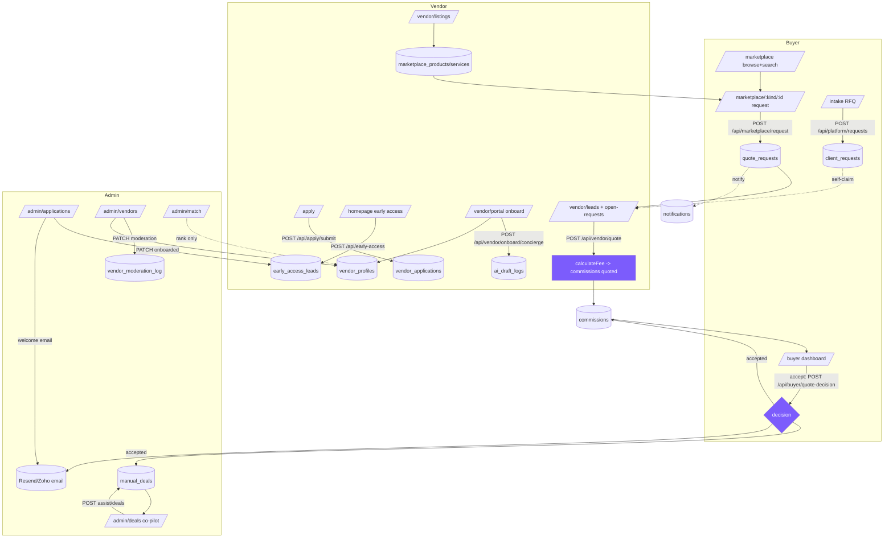

# Flow — how the whole NXT//LINK system works together

> End-to-end map of the live marketplace: **SCREEN (route) → API (route.ts) →
> DB tables → side effects (fee engine, emails, moderation, notifications).**
> Grounded in real files. Legacy intel/brain code (`src/lib/intelligence`,
> `src/lib/agents`, `archive/`) is **excluded** — not part of this flow.
> Live Supabase project `yvykselwehxjwsqercjg`; tables below confirmed present.

---

## Journey 1 — Buyer: land → RFQ / search → quote → accept → deal

| Step | Screen | API | Tables (r/w) | Side effects |
|---|---|---|---|---|
| 1. Land / browse | `/` , `/marketplace` (`src/app/marketplace/page.tsx`) | `GET /api/marketplace/listings`, `GET /api/marketplace/categories` | R `marketplace_products`, `marketplace_services`, `categories` | none (public read) |
| 2. Search autocomplete | marketplace search box | `GET /api/marketplace/suggest?q=` (`suggest/route.ts`) | R `marketplace_products`, `marketplace_services`, `categories` (only `status='published'` / `active`) | none |
| 3a. Request a quote on a listing | `/marketplace/[kind]/[id]` | `POST /api/marketplace/request` (`marketplace/request/route.ts:49`) | R listing (`tableFor(kind)`, must be `published`); **W `quote_requests`** (`status:'new'`, vendor_id from listing) | `notifyVendor()` → `notifications`; `sendMail()` to vendor (Resend/Zoho); honeypot + 1.5s anti-bot |
| 3b. Post an open RFQ (assistant) | `/intake` (`intake/page.tsx`) | intake assistant `POST /api/assistant/intake` → `POST /api/platform/requests` (`platform/requests/route.ts:54`) | **W `client_requests`** (`status:'request_received'`, `pipeline_stage:'new_request'`) | `logAudit()` → `platform_audit_log`; AI summary via `aiDraft` (Gemini + deterministic fallback) |
| 4. Matched to a vendor | (open RFQ) vendor pulls it in `/vendor/leads`; (admin) `/admin/match` | `GET /api/vendor/open-requests` then `POST` to claim; or admin `POST /api/match` | R `client_requests`; **W `quote_requests`** (open-requests POST creates the lead); match: R `vendor_profiles` ranked by `scoreVendors` | `notifyBuyer()` on vendor claim; match is admin-only ranking, no auto-write |
| 5. Compare quotes (fee shown) | `/buyer` (`buyer/page.tsx`), `/projects/[id]` | `GET /api/buyer/dashboard` (`buyer/dashboard/route.ts`) | R `client_requests`, `quote_requests`, `marketplace_products/services`, `reviews`, `pilots` — matched by **verified email** | requires `session.emailConfirmed`; buyer sees `quote_amount`, timeline fill bars |
| 6. Accept / decline | `/buyer` or `/projects/[id]` | `POST /api/buyer/quote-decision` (`buyer/quote-decision/route.ts`) | W `quote_requests` (`status won/lost`, `buyer_decision`); W `commissions` (`accepted`/`lost`); **W `manual_deals`** (draft, deduped by `source_quote_id`) | **`calculateFee(net)` runs here** (`route.ts:56`); `notifyVendor()`; `sendMail()` to vendor; 12-mo `protected_until` |
| 7. Deal/commission created | `/admin/deals` (operator confirms) | `GET/PATCH /api/admin/deals` | R/W `manual_deals`; R `commissions` | commission already computed at step 6; admin advances status to paid |

Anti-circumvention: buyer email/phone stay hidden in the vendor's leads inbox
until `buyer_decision='accepted'` (`vendor/leads/route.ts:66-74`); a
`buyer_profiles` card is then shared for accepted deals only.

---

## Journey 2 — Vendor: apply → onboard → listings → leads → quote → win → moderation

| Step | Screen | API | Tables (r/w) | Side effects |
|---|---|---|---|---|
| 1a. Early-access CTA | `/` homepage modal | `POST /api/early-access` (`early-access/route.ts`) | **W `early_access_leads`** | honeypot+1.5s; `isEmailBanned()` blocks re-apply (fails silently); notify email to `EARLY_ACCESS_NOTIFY_EMAIL` |
| 1b. Full application | `/apply` (`apply/page.tsx`) | `POST /api/apply/submit` (multipart) | **W `vendor_applications`** (`status:'pending'`); Storage `vendor-logos`, `vendor-product-images` | honeypot+1.5s; SVG blocked; tagged to `auth_id` if signed in |
| 2. Sign up / sign in | `/vendor-signup`, `/vendor-login`, `/login`, `/api/demo/login` | `POST /api/vendors/signup`, `POST /api/demo/login` | W auth user; `vendor_profiles` auto-created on first authed call | demo login creates pre-confirmed user (`NxtDemo2026!`), bypasses email wall |
| 3. Onboarding concierge | `/vendor/portal` (`vendor/portal/page.tsx`) | `POST /api/vendor/onboard/concierge` | R/creates `vendor_profiles`; **W `ai_draft_logs`** | `aiDraft()` (Gemini, `preferredProviders:['gemini']`, fallback deterministic) drafts description/tagline/categories/offerings — DRAFT only, vendor applies |
| 4. Profile + auto-save + strength | `/vendor/portal` | `PATCH /api/vendor/profile` (auto-save); `POST /api/vendor/profile/describe` | W `vendor_profiles` (scoped by `auth_id`); R brochures/videos/case_studies | `autoReactivateIfExpired()` on GET; "write my description" = `aiDraft`; Profile-Strength meter (client) |
| 5. Listings | `/vendor/listings` | `GET/POST/PATCH /api/vendor/listings` (+ `extract`, `media`, `extras`) | W `marketplace_products` / `marketplace_services`; Storage listing media | `scoreListing()` completeness % (`marketplace/completeness.ts`); AI extract from URL/brochure |
| 6. Opportunities / leads | `/vendor/leads`, `/vendor/portal` | `GET /api/vendor/leads`; `GET/POST /api/vendor/open-requests` | R `quote_requests` (mine), `commissions`, `pilots`, `buyer_profiles`; open RFQs from `client_requests` | contact masked until accept; open-request POST creates a lead + `notifyBuyer` |
| 7. Send quote | `/vendor/leads` quote form | `POST /api/vendor/quote` (`vendor/quote/route.ts`) | W `quote_requests` (`status:'responded'`, quote fields); **upsert `commissions`** (`status:'quoted'`) | **`calculateFee(amount)` runs here** (`route.ts:46`); `maskContacts()` on message; `notifyBuyer()`; `sendMail()` to buyer; 90-day `protected_until` |
| 8. Win | buyer accepts (Journey 1 step 6) | `POST /api/buyer/quote-decision` | W `commissions` `accepted`; W `manual_deals` draft | fee recomputed; vendor notified/emailed |
| 9. Moderation | `/admin/vendors` (admin) | `PATCH /api/vendors/manage` (`vendors/manage/route.ts`) | W `vendor_profiles` (`moderation_status`); **W `vendor_moderation_log`** | `active/suspended/banned` (`vendor/moderation.ts`); timed suspensions auto-reactivate on read; `logAudit()`; banned email can't reapply |

---

## Journey 3 — Admin / operator: applications → moderation → deals → fees

| Step | Screen | API | Tables (r/w) | Side effects |
|---|---|---|---|---|
| 1. Access | `/admin/*` | `POST /api/auth/access-code` (`ADMIN_ACCESS_CODE`) | — | httpOnly signed session cookie; every admin route gated by `isAdminRequest()` |
| 2. Review early-access leads | `/admin/applications` (`admin/applications/page.tsx`) | `GET/PATCH /api/admin/applications` | R/W **`early_access_leads`** (`new→contacted→onboarding→onboarded→declined`) | on transition **into `onboarded`** (once, `welcomed_at`): bilingual **welcome email** via `sendMail()` (skips `kind='buyer'`) |
| 3. Review buyer requests | `/admin/requests` | `GET /api/platform/requests` | R `client_requests` | — |
| 4. Match vendors to a request | `/admin/match` | `POST /api/match` | R `client_requests`, `vendor_profiles`, `vendor_brochures` | `scoreVendors()` ranking only — **no write, no vendor notification** |
| 5. Moderate vendors | `/admin/vendors` | `GET/PATCH /api/vendors/manage` | W `vendor_profiles`, **`vendor_moderation_log`** (audit) | suspend/ban/reactivate; `logAudit()`→`platform_audit_log`; auto-reactivate expired suspensions |
| 6. Log a deal (Commission Co-pilot) | `/admin/deals` (`admin/deals/page.tsx`) | `POST /api/admin/deals/assist` (parse+prefill) then `POST /api/admin/deals` (save) | assist: R `manual_deals` (summary); save: **W `manual_deals`** | assist runs `aiDraft` parse + **`calculateFee`** to prefill (never saves); save recomputes fee, blocks restricted vendors (409), applies `FREE_DEAL_CREDIT` |
| 7. Track fees / commissions | `/admin/deals`, `/admin/commissions` | `GET /api/admin/deals`, `GET /api/admin/commissions` | R `manual_deals`, `commissions` | policy summary returned (version, brackets, cap, free credit, protection months) |
| 8. Profile nudges (cron) | — (Vercel Cron) | `GET /api/cron/profile-nudges` (`CRON_SECRET`) | R/W `vendor_profiles` (`nudge_24_at`, `nudge_72_at`) | two waves (~24h/72h) `sendMail()` to vendors with incomplete profiles; skips banned/suspended |

---

## Money path (where the fee runs and how a quote becomes a commission)

**Single source of truth:** `src/lib/fees/engine.ts` → `calculateFee(net, policy=DEFAULT_FEE_POLICY)`.
Deterministic marginal brackets; AI never finalizes a fee.

- **Policy `launch-v2`** (confirmed live in `fee_policies`): **5%** on first **$50,000**,
  **3%** above, hard **cap $20,000** (`appliedMaximum`), `minimumFee: null`
  (`engine.ts:41-51`). Matches `vault/Fees.md`. Worked: $100k → $4,000 (4.0%);
  $500k → $16,000; $1M → capped $20k. `FREE_DEAL_CREDIT = 1250`,
  `PROTECTION_MONTHS = 12`.
- `calculateFee` runs in exactly four places:
  1. **Vendor sends a quote** — `POST /api/vendor/quote` (`route.ts:46`) → upserts
     `commissions` (`status:'quoted'`, `commission_amount`, `effective_rate`,
     `fee_policy_version`, 90-day `protected_until`). Also `GET` preview mode.
  2. **Buyer accepts** — `POST /api/buyer/quote-decision` (`route.ts:56`) → `commissions.status='accepted'`
     **and inserts a draft `manual_deals` row** deduped by `source_quote_id`
     (`net_amount`, `commission_amount`, `effective_rate`, `applied_cap`,
     `status:'won'`, 12-mo `protected_until`). **This closes the money loop.**
  3. **Commission Co-pilot** — `POST /api/admin/deals/assist` (`route.ts:83`) → computes
     fee to **prefill** the form (nothing saved).
  4. **Admin records a deal** — `POST /api/admin/deals` (`route.ts:33`) → inserts
     `manual_deals` (`status:'reserved'`), optional `FREE_DEAL_CREDIT` deduction,
     blocks suspended/banned vendors with 409.
- Two commission stores coexist: **`commissions`** (per `quote_request`, vendor-quote pipeline)
  and **`manual_deals`** (operator ledger). An accepted quote writes both.

---

## Handoffs & triggers (what advances state + what it needs)

- **Anti-bot gates**: honeypot `website_url` + 1.5s min-fill on `/api/apply/submit`,
  `/api/marketplace/request`, `/api/early-access`.
- **Email identity**: buyer dashboard & quote-decision require
  `session.emailConfirmed` (email is the buyer identity key — no `buyer_id` FK yet).
- **Notifications**: `src/lib/notify.ts` writes `notifications` (best-effort, never blocks).
- **Email**: `src/lib/mail.ts` → **Resend** (`RESEND_API_KEY`, `MAIL_FROM`) with
  automatic **Zoho SMTP** fallback (`ZOHO_*`). Fire-and-forget.
- **LLM**: `src/lib/assistant/llm.ts` `aiDraft()` → `runParallelJsonEnsemble`
  (`preferredProviders:['gemini']`, `GEMINI_API_KEY` etc.), **always** with a
  deterministic fallback, so every AI feature works keyless. Drafts logged to `ai_draft_logs`.
- **Moderation clock**: timed suspensions auto-flip to `active` on read
  (`autoReactivateIfExpired`, and bulk in `vendors/manage` GET), logged to `vendor_moderation_log`.
- **Cron**: `/api/cron/profile-nudges` needs `CRON_SECRET` (Vercel injects
  `Authorization: Bearer`); schedule in `vercel.json`.
- **Service role**: every write path uses `getSupabaseClient({ admin: true })`
  (`SUPABASE_SERVICE_ROLE_KEY`) — server-only, RLS bypassed by design.
- **Audit**: `logAudit()` → `platform_audit_log`; `logAiDraft()` → `ai_draft_logs`.

---

## Gaps found (most important first)

1. **FIXED** — Full vendor applications now have an admin review screen.
   New `/admin/vendor-applications` page + `GET/POST /api/admin/vendor-applications`
   list pending `vendor_applications` with their submitted details and give
   Approve / Reject actions (linked from `/admin/applications`).
2. **FIXED** — Buyer intake now reaches vendors automatically. New
   `src/lib/requests/dispatch.ts` (`dispatchRequestToVendors`) reuses `scoreVendors`
   to write leads into the matched vendors' inbox (`quote_requests`, same shape as
   open-requests) + `notifications`. Wired into `POST /api/platform/requests`
   (on request creation) and `POST /api/match` (admin `push:true` + "Push to
   vendors" button). Idempotent per (vendor, request).
3. **FIXED** — Approval now advances state AND creates the live vendor.
   `POST /api/admin/vendor-applications {action:'approve'}` idempotently
   creates/links a `vendor_profiles` row (status `approved`, moderation `active`)
   from the application data and sends the bilingual welcome email. NOTE: the DB
   trigger `guard_vendor_application_update` still holds the literal
   `vendor_applications.status` column for access-code admins (`is_admin()` is
   false without a Supabase auth session), so approval-state is tracked via the
   created `vendor_profiles` row; the status write is attempted and would also
   take effect under a real admin auth session. See `docs`/report.
4. **Two parallel "commission" ledgers can diverge.** `commissions` (from the
   vendor-quote pipeline) and `manual_deals` (operator/co-pilot) are written
   independently; an accepted quote writes both, but admin-logged `manual_deals`
   have no back-link to `commissions`, and status vocabularies differ
   (`quoted/accepted/won/lost` vs `reserved/won/…/paid`). No reconciliation step.
5. **`admin/deals/assist` prefill isn't linked to the source opportunity.** The
   co-pilot parses free text and prefills, but doesn't attach `source_quote_id`/
   `opportunity_ref`, so a co-pilot-logged deal can duplicate the auto-draft
   `manual_deals` row created at buyer-accept (dedupe only guards the accept path).
6. **`/admin/match` is the only consumer of `scoreVendors`; result is ephemeral.**
   No table stores the match, so ranking work isn't persisted or actionable.
7. **FIXED** — `demo/login` is now gated. `POST /api/demo/login` returns 404
   unless `ALLOW_DEMO_LOGIN==='true'` OR `NODE_ENV!=='production'`. Flag added to
   `.env.example`. Route kept (not deleted).
8. **Buyer identity is email-only** (no `buyer_id` FK on `quote_requests` /
   `client_requests`); correctness depends entirely on `emailConfirmed`. A buyer
   who changes email loses their history; case-sensitivity handled only via `ilike`.
9. **Empty live tables for built features** (`manual_deals`, `vendor_applications`,
   `early_access_leads`, `pilots`, `reviews`, `platform_audit_log` all 0 rows):
   code paths exist and are wired but unexercised — nothing proven end-to-end in prod yet.

---

## End-to-end flow (mermaid)

_Fee runs at the two `fee`-shaded nodes (vendor quote, buyer accept) plus the two
admin deal endpoints. `calculateFee` in `src/lib/fees/engine.ts` is the only
authority; policy `launch-v2` = 5% / 3% / $20k cap._
